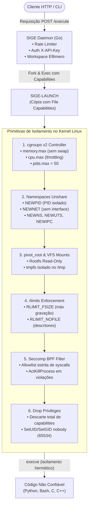

# 🛡️ SIGE — Sandbox de Isolamento para Execução Segura de Código

<p align="center">
  
  
  
  
  
  
</p>

<p align="center">
  <strong>Motor autônomo de julgamento de código não confiável (Online Judge / Code Runner Engine) de altíssimo desempenho e isolamento hermético.</strong><br />
  Combina a velocidade de instanciar sandboxes via chamadas nativas do kernel Linux (<code>cgroups v2</code>, <code>namespaces</code>, <code>pivot_root</code>, <code>seccomp BPF</code>) com uma arquitetura estrita de defesa em profundidade em múltiplas camadas.
</p>

---

## 📌 Sumário

- [Sobre o Projeto](#-sobre-o-projeto)
  - [O Desafio de Executar Código Não Confiável](#o-desafio-de-executar-código-não-confiável)
  - [Defesa em Profundidade (3 Camadas)](#defesa-em-profundidade-3-camadas)
  - [Diagrama da Arquitetura](#diagrama-da-arquitetura)
- [Performance & Benchmark de Latência](#-performance--benchmark-de-latência-cold-start)
- [Comparativo com Soluções Concorrentes](#️-comparativo-com-soluções-concorrentes)
  - [Citação das Soluções Analisadas](#-citação-das-soluções-analisadas)
  - [Matriz de Comparação Técnica](#matriz-de-comparação-técnica)
  - [Análise Diferencial Detalhada](#análise-diferencial-detalhada)
- [Funcionalidades Principais](#-funcionalidades-principais)
  - [Mecanismo de Isolamento & Segurança](#1-mecanismo-de-isolamento--segurança)
  - [Ciclo de Compilação Segura (C e C++)](#2-ciclo-de-compilação-segura-c-e-c)
  - [Modos de Avaliação da API REST](#3-modos-de-avaliação-da-api-rest)
  - [Interface CLI Nativa](#4-interface-cli-nativa)
- [Tecnologias Utilizadas](#-tecnologias-utilizadas)
- [Pré-requisitos do Sistema](#-pré-requisitos-do-sistema)
- [Instalação e Execução](#-instalação-e-execução)
  - [1. Executando com Docker Compose (Recomendado)](#1-executando-com-docker-compose-recomendado)
  - [2. Alternativa Standalone com Docker Run](#2-alternativa-standalone-com-docker-run)
  - [3. Obtenção da Chave e Teste Inicial](#3-obtenção-da-chave-e-teste-inicial)
  - [4. Execução Direta via Linha de Comando (CLI)](#4-execução-direta-via-linha-de-comando-cli)
- [Documentação da API REST](#-documentação-da-api-rest)
  - [Rotas Disponíveis](#rotas-disponíveis)
  - [Observabilidade: GET /health e GET /ready](#observabilidade-get-health-e-get-ready)
  - [Execução: POST /execute](#execução-post-execute)
  - [Exemplos Práticos por Modo](#exemplos-práticos-por-modo)
  - [Exemplo com Código em Base64 (file_base64)](#exemplo-com-código-em-base64-file_base64)
  - [Referência de Parâmetros e Status](#referência-de-parâmetros-e-status)
- [Variáveis de Ambiente](#-variáveis-de-ambiente)
- [Estrutura de Pastas](#-estrutura-de-pastas)
- [Testes e Engenharia de Segurança](#-testes-e-engenharia-de-segurança)
  - [Testes Unitários com Bypass Gracioso](#testes-unitários-com-bypass-gracioso)
  - [Suíte Adversarial de Testes Reais (39 Casos)](#suíte-adversarial-de-testes-reais-testreal_cases)
  - [Rastreabilidade e Imunidade a CVEs Críticas (Judge0)](#-rastreabilidade-e-imunidade-a-cves-críticas-judge0)
  - [Análise Estática de Vulnerabilidades](#análise-estática-de-vulnerabilidades)
- [Como Contribuir](#-como-contribuir)
- [Licença e Créditos](#-licença-e-créditos)

---

## 📖 Sobre o Projeto

O **SIGE** é um motor de execução e correção automatizada de código (*Code Runner / Online Judge Engine*) desenvolvido em Go. Foi concebido para atender plataformas de ensino de programação, sistemas de submissão de maratonas (como Codeforces e Beecrowd) e esteiras que demandem execução de código de terceiros com latência em milissegundos e blindagem absoluta contra ataques ao hospedeiro.

### O Desafio de Executar Código Não Confiável

Executar código arbitrário submetido remotamente é uma das tarefas mais críticas em segurança de sistemas. Sem contenção granular de baixo nível, o host fica exposto a:
- **Exaustão de Recursos:** *Fork bombs* (esgotamento da tabela de PIDs), alocação descontrolada de RAM gerando OOM (*Out of Memory*) e laços infinitos saturando a CPU.
- **Vazamento e Violação de Arquivos:** Leitura de credenciais de ambiente, arquivos do host (`/etc/shadow`, `/proc`) e gravação de arquivos maliciosos.
- **Ataques de Rede:** Conexões reversas, sondagem de serviços internos em rede local e ataques *Server-Side Request Forgery* (SSRF).
- **Escalação de Privilégios (*Privilege Escalation*):** Invocação de chamadas de sistema vulneráveis ou manipulação de capabilities para assumir privilégios de `root`.

### Defesa em Profundidade (3 Camadas)

O SIGE implementa o princípio da **Defesa em Profundidade** (*Defense in Depth*), garantindo que a quebra de uma barreira seja prontamente contida pela camada adjacente:

```text
┌──────────────────────────────────────────────────────────────────┐
│ CAMADA 1: CONTENÇÃO EXTERNA (Container Docker)                  │
│ • Limites rígidos do daemon (mem_limit: 4g, cpus: 4.0, pids: 1024)│
│ • Rede externa loopback-only (127.0.0.1)                         │
├──────────────────────────────────────────────────────────────────┤
│ CAMADA 2: MEDIAÇÃO DE CONTROLE (SIGE Daemon em Go)               │
│ • Token Bucket Rate Limiting por IP (10 req/s, burst 20)        │
│ • Autenticação constante de tempo (subtle.ConstantTimeCompare)    │
│ • Timeout de requisição e proteção contra Slowloris              │
│ • Validação de payload estrita (máx 10 MB) e sanitização de nomes│
├──────────────────────────────────────────────────────────────────┤
│ CAMADA 3: CONTENÇÃO INTERNA NO KERNEL (Linux Nativo)             │
│ • cgroups v2: memory.max (sem swap), cpu.max, pids.max (50)     │
│ • Namespaces: CLONE_NEWPID, NEWNET (sem rotas), NEWNS, UTS, IPC  │
│ • pivot_root: Rootfs /bin, /usr, /lib somente-leitura            │
│ • Filesystem efêmero: /tmp isolado em tmpfs com quota rígida    │
│ • Seccomp BPF: Allowlist restrita; mata processo via SIGSYS      │
│ • Privilégio Mínimo: Queda irrestrita para nobody (UID 65534)   │
└──────────────────────────────────────────────────────────────────┘
```

### Diagrama da Arquitetura



---

## ⚡ Performance & Benchmark de Latência (Cold Start)

Diferente de arquiteturas que invocam uma nova instância de container para cada submissão (criando enorme sobrecarga de I/O e namespaces Docker), o SIGE roda como um daemon residente e instancia o isolamento **diretamente nas interfaces do kernel Linux**.

| Solução | Abordagem | Tempo de Inicialização (*Cold Start*) | Consumo Base de Memória |
| :--- | :--- | :---: | :---: |
| **Docker run avulso** | Container completo por submissão | `~450ms – 1200ms` | `~35 MB` por execução |
| **MicroVMs (ex: Firecracker)** | Virtualização baseada em KVM | `~120ms – 250ms` | `~10 MB – 15 MB` |
| **SIGE (Kernel Primitives + Go)** | **cgroups v2 + namespaces + seccomp** | **`~8ms – 20ms`** | **`< 2 MB` por sandbox** |

> 🚀 **Vantagem Competitiva:** O SIGE oferece latência de início imediata com uma fração do consumo de hardware de uma VM ou de um container comum, possibilitando a execução concorrente de centenas de avaliações por minuto em servidores modestos.

---

## ⚖️ Comparativo com Soluções Concorrentes

No ecossistema de avaliação remota e execução segura de código não confiável (*Online Judges* e *Remote Code Runners*), existem diferentes abordagens consolidadas com *trade-offs* bem definidos entre isolamento, latência, consumo de recursos e complexidade operacional.

O **SIGE** foi desenhado especificamente para preencher a lacuna entre ferramentas CLI de baixo nível (como o *Isolate*) e plataformas web monolíticas e pesadas (como o *Judge0* e *Piston*).

---

### 📚 Citação das Soluções Analisadas

Para uma comparação transparente e técnica, relacionamos abaixo os principais motores de execução e sandboxing do estado da arte:

1. **[Judge0](https://github.com/judge0/judge0)** — Mantido por Herman Zvonimir Došilović / Judge0 Team. Plataforma de execução de código robusta e amplamente utilizada, integrando múltiplos runtimes sobre Ruby on Rails, Docker e Isolate.
2. **[Isolate](https://github.com/ioi/isolate)** — Mantido por Martin Mareš / International Olympiad in Informatics (IOI). O padrão da indústria para olimpíadas internacionais de computação, focado em CLI de baixo nível em C com controle via cgroups e namespaces.
3. **[Piston](https://github.com/engineer-man/piston)** — Mantido pela organização Engineer Man. Motor popular de execução de código em Node.js com arquitetura de pacotes e containers independentes.
4. **[Firecracker](https://github.com/firecracker-microvm/firecracker)** — Desenvolvido pela Amazon Web Services (AWS) em Rust. Tecnologia de microVMs baseada em KVM que alimenta o AWS Lambda e AWS Fargate.
5. **[gVisor (runsc)](https://github.com/google/gvisor)** — Desenvolvido pelo Google em Go. Runtime de container compatível com OCI que implementa um kernel de espaço de usuário (*Sentry*) para interceptar syscalls.
6. **[DMOJ Judge Server](https://github.com/DMOJ/judge-server)** — Mantido pelo projeto open source DMOJ (Modern Online Judge). Motor de julgamento em Python e C voltado a plataformas competitivas de grande porte.

---

### Matriz de Comparação Técnica

| Critério de Engenharia | 🛡️ **SIGE** | 📦 [Judge0](https://github.com/judge0/judge0) | ⚙️ [Isolate](https://github.com/ioi/isolate) | 🔌 [Piston](https://github.com/engineer-man/piston) | 🏛️ [DMOJ](https://github.com/DMOJ/judge-server) | 🔥 [Firecracker](https://github.com/firecracker-microvm/firecracker) | 🛡️ [gVisor](https://github.com/google/gvisor) |
| :--- | :---: | :---: | :---: | :---: | :---: | :---: | :---: |
| **Tecnologia Principal** | **Go nativo + Kernel** | Ruby on Rails + C | C puro | Node.js / Express | Python + C | Rust (KVM MicroVM) | Go (User-space Kernel) |
| **Latência de Cold Start** | **8ms – 20ms** | 80ms – 180ms | 3ms – 8ms | 90ms – 200ms | 25ms – 60ms | 120ms – 250ms | 30ms – 90ms |
| **Consumo de Memória (Idle)**| **~15 MB** | > 600 MB | N/A (CLI) | ~120 MB | ~180 MB | ~15 MB / VM | ~25 MB / sandbox |
| **Dependências de Infraestrutura**| **Nenhuma** (Zero DB) | PostgreSQL + Redis | Nenhuma | Nenhuma | Redis + Celery / DB | KVM / Bare-metal | Nenhuma |
| **Filtro Seccomp BPF Estrito** | **Sim** (`ActKillProcess`) | Sim (via Isolate) | Sim | Parcial / Opcional | Sim | N/A (Hardware VM) | Emulação de Syscall |
| **API REST Nativa Embutida** | **Sim** (HTTP/REST) | Sim | Não (Apenas CLI) | Sim | Não (RPC / Polling) | Não (Apenas VM) | Não (Runtime OCI) |
| **Bateria Concorrente Embutida** | **Sim** (Multi-Evaluation) | Parcial (Assíncrono) | Não | Não | Sim (Fila distribuída) | Não | Não |
| **Imunidade Estrutural a Symlink/SSRF** | **Sim** (Por Design) | ⚠️ Histórico CVEs (10.0)| N/A | Depende do host | Requer hardening | Sim | Sim |
| **Complexidade de Deploy** | **1 Container Docker** | 4+ Containers | Manual no Host | 1-2 Containers | 3+ Serviços | Requer host KVM | Configuração Docker |

---

### Análise Diferencial Detalhada

#### 1. SIGE vs. [Judge0](https://github.com/judge0/judge0)
- **Pegada de Recursos & Arquitetura:** O Judge0 é construído sobre Ruby on Rails e requer obrigatoriamente um banco PostgreSQL e uma instância Redis com workers de background para gerenciar filas assíncronas. O SIGE é um binário único compilado em Go, operando de forma 100% *stateless* e consumindo menos de 20 MB de RAM em repouso.
- **Segurança & Superfície de Ataque:** O Judge0 foi impactado em 2024 por três vulnerabilidades de pontuação máxima (**CVSS 10.0**) relacionadas a desvios de escrita por symlink no host (`CVE-2024-28185`, `CVE-2024-28189`) e SSRF via callbacks HTTP (`CVE-2024-29021`). O SIGE é estruturalmente imune a essas classes de ataque por nunca executar operações de filesystem dirigidas pelo usuário no host e por operar com namespace de rede estritamente desconectado (`CLONE_NEWNET`), sem interfaces de rede ou callbacks de saída.
- **Quando escolher o Judge0:** Se a sua plataforma necessitar de suporte imediato a dezenas de linguagens exóticas/compiladores prontos para uso ou do ecossistema comercial pré-integrado do Judge0.
- **Quando escolher o SIGE:** Se você precisa de um motor enxuto, rápido, de fácil hospedagem (1 único container sem banco de dados), com consumo mínimo de memória e garantia estrita contra escape de sandbox.

#### 2. SIGE vs. [Isolate](https://github.com/ioi/isolate) (International Olympiad in Informatics)
- **Escopo e Usabilidade:** O Isolate é a referência mundial em maratonas de programação como utilitário de terminal em C. No entanto, ele é estritamente uma ferramenta CLI de baixo nível. Para utilizá-lo em uma arquitetura web moderna, é necessário construir um servidor HTTP em volta, gerenciar concorrência, rate limiting e empacotamento em containers.
- **A Proposta do SIGE:** O SIGE absorve o rigor de isolamento do Isolate (cgroups v2, namespaces e seccomp BPF), reimplementando-o em Go com uma API REST nativa, controle de taxa por IP (*Token Bucket*), validação antecipada de payloads e paralelização inteligente de baterias de testes.
- **Quando escolher o Isolate:** Em ambientes de competição presenciais de maratona (como IOI ou ICPC) onde scripts locais em Bash ou C orquestram as submissões diretamente no host Linux.

#### 3. SIGE vs. [Piston](https://github.com/engineer-man/piston) (Engineer Man)
- **Foco Arquitetural:** O Piston foi desenhado com foco em variedade e facilidade de suporte a múltiplos runtimes e pacotes comunitários, rodando sobre Node.js e orquestração de containers.
- **Rigor de Isolamento:** O SIGE prioriza contenção no kernel: allowlist restrita de syscalls com terminação imediata (`ActKillProcess`), cgroups v2 com bloqueio irrestrito de swap, limitação de tamanho de arquivos em disco via rlimits e compilação segregada em sandbox isolado para C e C++.
- **Quando escolher o Piston:** Para bots de Discord ou ferramentas de aprendizado onde suporte rápido a novos pacotes e bibliotecas de terceiros é mais importante que isolamento estrito contra ataques de kernel.

#### 4. SIGE vs. [DMOJ Judge Server](https://github.com/DMOJ/judge-server)
- **Complexidade de Integração:** O DMOJ é um ecossistema completo para juízes online com suporte a dezenas de tipos de problemas, mas o `judge-server` foi concebido para se comunicar com o backend central do DMOJ via protocolo próprio de polling/sockets.
- **Abordagem do SIGE:** O SIGE adota uma interface REST HTTP padrão com autenticação por chave de API, tornando-o universalmente integrável a qualquer backend (Django, Laravel, Next.js, Spring Boot, etc.), além de ser totalmente autônomo sem necessidade de workers adicionais.

#### 5. SIGE vs. [Firecracker](https://github.com/firecracker-microvm/firecracker) (AWS MicroVMs)
- **Virtualização vs. Confinamento no Kernel:** O Firecracker provê isolamento por hardware via KVM (máquinas virtuais). Isso exige instâncias dedicadas (*bare-metal*) ou servidores de nuvem com suporte a virtualização aninhada (*nested virtualization*).
- **Cold Start & Agilidade:** O SIGE inicializa em ~8ms–20ms (contra ~120ms–250ms de uma microVM). O SIGE pode ser executado em qualquer VPS Linux padrão, sem necessidade de KVM ou permissões especiais de virtualização.
- **Quando escolher o Firecracker:** Para arquiteturas multi-tenant de cloud pública executando código arbitrário com acesso total a rede ou onde a exigência de isolamento por hardware KVM seja um requisito regulatório inegociável.

#### 6. SIGE vs. [gVisor](https://github.com/google/gvisor) (Google runsc)
- **Overhead de Syscalls:** O gVisor implementa um kernel em espaço de usuário (*Sentry*) para interceptar todas as chamadas de sistema. Embora seguro, introduz um overhead perceptível em programas intensivos em I/O ou em processos que compilam muito código (como `gcc` e `g++`).
- **Abordagem do SIGE:** O SIGE utiliza o kernel Linux nativo com filtros declarativos em BPF (Seccomp), permitindo que chamadas autorizadas executem com overhead zero de emulação, garantindo tempos de compilação e execução idênticos ao bare-metal.
- **Quando escolher o gVisor:** Quando você já possui um cluster Kubernetes gerenciado e deseja rodar Pods com isolamento adicional usando um runtime OCI compatível.

---

## ⚙️ Funcionalidades Principais

### 1. Mecanismo de Isolamento & Segurança
- **Controle de Processos & Memória (cgroups v2):** O processo é alocado em um cgroup dedicado. `memory.max` impede alocações abusivas (sem permissão de swap para evitar travamento de disco do host) e `pids.max` neutraliza imediatamente qualquer tentativa de *fork bomb*.
- **Isolamento de Rede Hermético:** Desacoplamento via `CLONE_NEWNET` sem interface loopback exposta nem tabelas de roteamento para a máquina hospedeira. Chamadas a sockets de rede externos falham no ato (`EPERM` / `ENETUNREACH`).
- **Sistema de Arquivos Read-Only (`pivot_root`):** O processo tem sua raiz trocada para uma árvore somente-leitura. Tentativas de alterar binários do sistema, criar arquivos em `/etc` ou ler segredos são bloqueadas pelo VFS do Linux com `EROFS` (*Read-only file system*).
- **Filtro Seccomp BPF (Modo Allowlist):** Filtro de chamadas de sistema restritivo. Tentativas de invocação de chamadas perigosas como `unshare`, `ptrace`, `reboot`, `mount` ou criação de namespaces não autorizados provocam o encerramento do processo no ato pelo kernel (`SIGSYS` / `ActKillProcess`).
- **Privilégios Mínimos:** Todo código é rebaixado antes da execução para o usuário não-privilegiado `nobody` (UID/GID `65534`) e todas as *Linux Capabilities* são limpas (`NoNewPrivs`).

### 2. Ciclo de Compilação Segura (C e C++)

Códigos em C e C++ passam por um ciclo de execução em **duas etapas totalmente segregadas**:

1. **Etapa 1 (Compilação Confinada):** O compilador (`gcc` ou `g++`) é executado **dentro de um sandbox próprio e isolado**, com limites dedicados:
   - **RAM:** 256 MB
   - **Tempo de CPU:** 10 segundos
   - **Espaço temporário (`/tmp`):** 64 MB
   - *Proteção:* Ataques baseados em inclusão recursiva de cabeçalhos (*preprocessor bombs*) ou consumo abusivo de templates C++ são contidos e resultam em `compilation_error` sem afetar a saúde da API.
2. **Etapa 2 (Execução da Solução):** O binário compilado resultante (`/workspace/solution`) é executado em um **segundo sandbox**, sujeito aos limites solicitados na requisição (ou padrões do servidor).

### 3. Modos de Avaliação da API REST
- **Modo `interpreter`:** Execução direta com limites padrão globais. Retorna saídas brutas (`stdout`, `stderr`), código de término (`exit_code`), tempo de CPU decorrido e pico de memória física consumida.
- **Modo `single_evaluation`:** Avalia o programa contra a saída esperada (`expected_stdout`), validando o acerto (`PASS` ou `FAIL`) e admitindo limites customizados na requisição.
- **Modo `multi_evaluation`:** Bateria concorrente de até 20 casos de teste (`test_cases`), paralelizando até 4 sandboxes simultâneos com detecção e diagnóstico da primeira falha.

### 4. Interface CLI Nativa
- O comando `run-task` permite disparar tarefas avulsas pelo terminal, com flags completas para controle de limites (`--mem`, `--cpu`, `--timeout`, `--tmp-limit`, `--file-limit`, `--nofile-limit`), ideal para diagnósticos, scripts locais e pipelines CI/CD.

---

## 🛠️ Tecnologias Utilizadas

| Camada | Tecnologia | Propósito e Descrição |
| :--- | :--- | :--- |
| **Backend & Daemon** |  | Core do servidor HTTP, orquestração concorrente e chamadas de sistema |
| **Interface CLI** |  | Interface de linha de comando (`run-task`, `api`, `cgroups-version`) |
| **Kernel & Recursos** |  | Gerenciamento de CPU, memória e limites de PIDs via `containerd/cgroups/v3` |
| **Filtro de Syscalls** |  | Allowlist de chamadas de sistema e encerramento imediato via `libseccomp-golang` |
| **Segurança Linux** |  | Execução desprivilegiada (UID 65534 `nobody`) e elevação controlada via file capabilities |
| **Containerização** |  | Confinamento primário externo e compilação reproduzível *multi-stage* |
| **Orquestração** |  | Provisionamento com `cap_add: SYS_ADMIN` e configuração via `.env` |

---

## 📋 Pré-requisitos do Sistema

> [!CAUTION]
> **⚠️ AMBIENTE DE EXECUÇÃO OBRIGATÓRIO:** O SIGE **só deve ser executado dentro de containers Docker**.  
> Executá-lo diretamente no host exigiria privilégios de `root`, alteraria a árvore de cgroups nativa da máquina hospedeira (gerando conflitos graves com o gerenciador `systemd`) e montaria arquivos vitais do seu host (`/usr`, `/bin`, `/etc`) no sandbox. O container Docker fornece o isolamento inicial indispensável.

1. **Sistema Operacional Hospedeiro:** Linux com **cgroups v2 unificado** (nativo no Ubuntu 22.04+, Debian 11+, Fedora 34+, Arch Linux).
   - Verifique a compatibilidade no terminal do host:
     ```bash
     stat -fc %T /sys/fs/cgroup/
     # Deve retornar obrigatoriamente: cgroup2fs
     ```
   - Ou checando pelo próprio binário do SIGE:
     ```bash
     ./sige cgroups-version
     # Retorno esperado: cgroup version: v2 (Unified)
     ```
2. **Docker Engine:** Versão 24.0 ou superior.
3. **Docker Compose:** Versão v2.21 ou superior (`docker compose`, sem hífen).

---

## 🚀 Instalação e Execução

### 1. Executando com Docker Compose (Recomendado)

```bash
# 1. Clonar o repositório
git clone https://github.com/Geraldoaf/sige.git
cd sige

# 2. Copiar o arquivo de ambiente (opcional, defaults seguros inclusos)
cp .env.example .env

# 3. Construir a imagem e iniciar em segundo plano
docker compose up -d --build
```

### 2. Alternativa Standalone com Docker Run

Caso deseje subir a API sem Docker Compose, execute o comando com as flags de contenção do kernel exigidas:

```bash
docker run -d \
  --name sige-api-server \
  -p 127.0.0.1:8080:8080 \
  --memory=4g \
  --cpus=4.0 \
  --pids-limit=1024 \
  --cap-add=SYS_ADMIN \
  --security-opt apparmor=unconfined \
  --security-opt seccomp=unconfined \
  --security-opt no-new-privileges=false \
  --cgroupns private \
  -v sige-state:/var/lib/sige \
  sige-app:latest
```

> **Explicação das Flags de Kernel:**
> - `--cap-add=SYS_ADMIN`: Permite a criação de namespaces internos e chamada a `pivot_root`.
> - `--security-opt no-new-privileges=false`: Permite que o binário interno `sige-launch` utilize *file capabilities* (`setcap`) para configurar o sandbox antes de rebaixar para `nobody`.
> - `--cgroupns private`: Garante que os caminhos de cgroups vistos dentro do container sejam virtuais e isolados do host.

### 3. Obtenção da Chave e Teste Inicial

No primeiro início, se nenhuma chave for definida em `SIGE_API_KEY`, uma nova chave de 32 bytes em hexadecimal é gerada automaticamente e registrada nos logs:

```bash
docker compose logs sige-api | grep "X-API-Key"
```

Saída:
```text
[SIGE]   X-API-Key: 99b1d54121271ddf4c8e7502...
```

Disparando a primeira chamada de teste:

```bash
curl -X POST http://127.0.0.1:8080/execute \
  -H "X-API-Key: SUA_CHAVE_AQUI" \
  -H "Content-Type: application/json" \
  -d '{
    "language": "python",
    "code": "print(2 + 2)"
  }'
```

Resposta:
```json
{
  "mode": "interpreter",
  "result": "completed",
  "passed_count": 1,
  "total_count": 1,
  "execution": {
    "stdout": "4\n",
    "stderr": "",
    "duration_ms": 15,
    "memory_peak_bytes": 8388608,
    "exit_code": 0,
    "status": "success",
    "limit_memory_bytes": 52428800,
    "limit_cpu": "50%",
    "limit_timeout_sec": 5
  }
}
```

### 4. Execução Direta via Linha de Comando (CLI)

O subcomando `run-task` executa um comando arbitrário diretamente dentro do sandbox, sem passar pela API HTTP:

```bash
# Execução avulsa com limites customizados (64MB RAM, 5s timeout, 50% CPU)
docker compose run --rm sige-api \
  run-task --mem 64 --cpu 50% --timeout 5 -- python3 -c "print('Executado no sandbox com sucesso!')"

# Inspecionando o isolamento do processo no container ativo:
docker compose exec sige-api \
  /opt/sige/sige run-task --mem 32 --timeout 3 -- python3 -c "import os; print('UID:', os.getuid(), '| PID:', os.getpid())"
# Saída esperada: UID: 65534 (nobody) | PID: 2 (espaço de PIDs isolado)
```

---

## 🔌 Documentação da API REST

### Rotas Disponíveis

| Método | Endpoint | Autenticação | Descrição |
| :--- | :--- | :---: | :--- |
| `GET` | `/health` | Pública | Liveness probe básica (status `UP` e timestamp). |
| `GET` | `/ready` | Pública | Readiness probe validando cgroups v2, launcher e capacidade. |
| `GET` | `/languages` | `X-API-Key` | Catálogo de linguagens suportadas e limites padrão. |
| `GET` | `/capacity` | `X-API-Key` | Estatísticas em tempo real de sandboxes ativos e slots livres. |
| `GET` | `/metrics` | `X-API-Key` | Telemetria e contadores de execuções, timeouts e OOMs. |
| `POST` | `/validate` | `X-API-Key` | *Dry-run* sintático e estrutural sem alocar sandboxes no kernel. |
| `POST` | `/execute` | `X-API-Key` | Execução isolada nos modos `interpreter`, `single` e `multi`. |

---

### Observabilidade: `GET /health` e `GET /ready`

#### `GET /health`
Verifica se o servidor web está ativo:
```json
{
  "status": "UP",
  "timestamp": "2026-09-04T20:15:00Z"
}
```

#### `GET /ready`
Inspeciona as condições do kernel Linux e a capacidade do servidor:
```json
{
  "ready": true,
  "timestamp": "2026-09-04T20:15:00Z",
  "checks": {
    "cgroups_v2": "ok",
    "launcher_binary": "ok",
    "pool_capacity": "ok"
  }
}
```

---

### Execução: `POST /execute`

O comportamento do endpoint `/execute` varia de acordo com o modo configurado em `SIGE_API_MODE`:

| Modo | Finalidade | Aceita Limites Customizados? | Aceita Casos de Teste? |
| :--- | :--- | :---: | :---: |
| `interpreter` *(padrão)* | Execução pura e direta. Retorna saída bruta. | ❌ *(usa padrões do servidor)* | ❌ |
| `single_evaluation` | Avalia contra `expected_stdout` $\rightarrow$ `PASS` / `FAIL`. | ✔️ | ✔️ (caso único) |
| `multi_evaluation` | Avalia bateria de `test_cases` em paralelo. | ✔️ | ✔️ (até 20 casos) |

---

### Exemplos Práticos por Modo

#### 1. Modo `interpreter` (Execução Direta)

```bash
curl -X POST http://127.0.0.1:8080/execute \
  -H "X-API-Key: SUA_API_KEY" \
  -H "Content-Type: application/json" \
  -d '{
    "language": "python",
    "code": "import sys\nnumeros = list(map(int, sys.stdin.read().split()))\nprint(f\"Soma: {sum(numeros)}\")",
    "stdin": "10 20 30 40\n"
  }'
```

**Resposta:**
```json
{
  "mode": "interpreter",
  "result": "completed",
  "passed_count": 1,
  "total_count": 1,
  "execution": {
    "stdout": "Soma: 100\n",
    "stderr": "",
    "duration_ms": 16,
    "memory_peak_bytes": 8388608,
    "exit_code": 0,
    "status": "success",
    "limit_memory_bytes": 52428800,
    "limit_cpu": "50%",
    "limit_timeout_sec": 5
  }
}
```

---

#### 2. Modo `single_evaluation` (Avaliação com Limites)

*Requer `SIGE_API_MODE=single_evaluation`*. Avalia código em C contra a saída esperada impondo 64 MB de RAM, 80% de CPU e 3s de timeout:

```bash
curl -X POST http://127.0.0.1:8080/execute \
  -H "X-API-Key: SUA_API_KEY" \
  -H "Content-Type: application/json" \
  -d '{
    "language": "c",
    "code": "#include <stdio.h>\nint main() { int a, b; if (scanf(\"%d %d\", &a, &b) == 2) printf(\"%d\\n\", a * b); return 0; }",
    "stdin": "6 7\n",
    "expected_stdout": "42\n",
    "memory_mb": 64,
    "cpu": "80%",
    "timeout_sec": 3,
    "tmp_limit_mb": 32,
    "max_file_size_mb": 5,
    "max_open_files": 128
  }'
```

**Resposta de Sucesso (`PASS`):**
```json
{
  "mode": "single_evaluation",
  "result": "PASS",
  "passed_count": 1,
  "total_count": 1,
  "execution": {
    "stdout": "42\n",
    "stderr": "",
    "duration_ms": 6,
    "memory_peak_bytes": 2097152,
    "exit_code": 0,
    "status": "success",
    "limit_memory_bytes": 67108864,
    "limit_cpu": "80%",
    "limit_timeout_sec": 3
  }
}
```

**Resposta em caso de Discrepância (`FAIL` / `output_mismatch`):**
```json
{
  "mode": "single_evaluation",
  "result": "FAIL",
  "error_type": "output_mismatch",
  "expected": "42\n",
  "actual": "40\n",
  "passed_count": 0,
  "total_count": 1,
  "execution": {
    "stdout": "40\n",
    "stderr": "",
    "duration_ms": 5,
    "exit_code": 0,
    "status": "success"
  }
}
```

---

#### 3. Modo `multi_evaluation` (Bateria Concorrente de Testes)

*Requer `SIGE_API_MODE=multi_evaluation`*. Avalia código C++ contra 4 casos de teste simultâneos:

```bash
curl -X POST http://127.0.0.1:8080/execute \
  -H "X-API-Key: SUA_API_KEY" \
  -H "Content-Type: application/json" \
  -d '{
    "language": "cpp",
    "code": "#include <iostream>\nusing namespace std;\nint main() { int n; cin >> n; cout << (n % 2 == 0 ? \"PAR\" : \"IMPAR\") << endl; return 0; }",
    "memory_mb": 128,
    "timeout_sec": 2,
    "test_cases": [
      { "stdin": "2\n", "expected_stdout": "PAR\n" },
      { "stdin": "7\n", "expected_stdout": "IMPAR\n" },
      { "stdin": "100\n", "expected_stdout": "PAR\n" },
      { "stdin": "15\n", "expected_stdout": "IMPAR\n" }
    ]
  }'
```

**Resposta (Todos Aprovados):**
```json
{
  "mode": "multi_evaluation",
  "result": "PASS",
  "passed_count": 4,
  "total_count": 4
}
```

---

### Exemplo com Código em Base64 (`file_base64`)

Para integrações via SDK, clientes HTTP ou códigos que contenham caracteres binários, aspas complexas ou arquivos multilinhas, recomenda-se o uso do campo `file_base64`:

```bash
# Codificando um script Python em base64:
# echo "print('Executado via Base64!')" | base64
# Resultado: cHJpbnQoJ0V4ZWN1dGFkbyB2aWEgQmFzZTY0IScpCg==

curl -X POST http://127.0.0.1:8080/execute \
  -H "X-API-Key: SUA_API_KEY" \
  -H "Content-Type: application/json" \
  -d '{
    "language": "python",
    "file_base64": "cHJpbnQoJ0V4ZWN1dGFkbyB2aWEgQmFzZTY0IScpCg==",
    "filename": "meu_script.py"
  }'
```

---

### Referência de Parâmetros e Status

#### Parâmetros Suportados na Requisição

| Campo | Tipo | Modos | Obrigatório | Descrição |
| :--- | :--- | :--- | :---: | :--- |
| `language` | `string` | Todos | **Sim** | `python`, `python3`, `bash`, `sh`, `c`, `cpp`, `c++`. |
| `code` | `string` | Todos | Condicional* | Código-fonte em texto plano (*obrigatório se `file_base64` ausente). |
| `file_base64` | `string` | Todos | Condicional* | Código-fonte codificado em Base64 (máx. 2 MB). |
| `filename` | `string` | Todos | Não | Nome customizado do arquivo no workspace temporário. |
| `stdin` | `string` | `interpreter`, `single` | Não | Entrada enviada para a `stdin` do processo. |
| `expected_stdout` | `string` | `single_evaluation` | **Sim** | Saída esperada para comparação. |
| `test_cases` | `array` | `multi_evaluation` | **Sim** | Bateria de testes: `[{ "stdin": "...", "expected_stdout": "..." }]` (máx. 20). |
| `memory_mb` | `int` | `single`, `multi` | Não | Limite de memória física (RAM) em MB. |
| `cpu` | `string` | `single`, `multi` | Não | Cota de CPU (ex: `"50%"`, `"100"` ou `"50000 100000"`). |
| `timeout_sec` | `int` | `single`, `multi` | Não | Tempo máximo de execução em segundos. |
| `tmp_limit_mb` | `int` | `single`, `multi` | Não | Tamanho do `/tmp` efêmero em tmpfs (em MB). |
| `max_file_size_mb`| `int` | `single`, `multi` | Não | Maior arquivo que o código pode gravar (`RLIMIT_FSIZE`). |
| `max_open_files` | `int` | `single`, `multi` | Não | Quantidade máxima de descritores abertos (`RLIMIT_NOFILE`). |

#### Status de Execução (`execution.status`)

| Status | Significado | Ação do SIGE |
| :--- | :--- | :--- |
| `success` | Concluído com sucesso (`exit_code == 0`). | Saída normal capturada. |
| `timeout` | Tempo de CPU/relógio estourado. | Cgroup inteiro finalizado com `SIGKILL`. |
| `oom` | Limite de memória RAM ultrapassado. | Processo encerrado pelo OOM Killer do cgroup. |
| `output_limit_exceeded`| `stdout`/`stderr` ultrapassou 1 MB. | Execução terminada para evitar inundações. |
| `file_size_exceeded` | Tentou gravar arquivo acima de `max_file_size_mb`. | Abortado pelo kernel via `SIGXFSZ` (`RLIMIT_FSIZE`). |
| `compilation_error` | Falha na compilação do código C/C++. | Retorna `200 OK` com os erros do compilador em `stderr`. |
| `failed` | Encerramento com erro de runtime ou violação de seccomp. | Processo morto por sinal ou código de saída diferente de zero. |

---

## ⚙️ Variáveis de Ambiente

As configurações do SIGE podem ser customizadas através do arquivo `.env` na raiz do projeto (copiado a partir do `.env.example`):

```ini
# ==============================================================================
# 1. AUTENTICAÇÃO E SEGURANÇA
# ==============================================================================
# Chave de acesso da API. Se vazia, uma nova chave será gerada e persistida.
SIGE_API_KEY=

# Permite chamadas sem autenticação (APENAS para desenvolvimento local)
SIGE_ALLOW_UNAUTHENTICATED=false

# IPs de proxies confiáveis separados por vírgula (para validar cabeçalho X-Real-IP)
SIGE_TRUSTED_PROXIES=

# ==============================================================================
# 2. MODO DE OPERAÇÃO E CONCORRÊNCIA
# ==============================================================================
# Modo da API: interpreter | single_evaluation | multi_evaluation
SIGE_API_MODE=interpreter

# Teto global de sandboxes simultâneos executando no servidor
SIGE_MAX_CONCURRENT_SANDBOXES=8

# ==============================================================================
# 3. LIMITES PADRÃO POR EXECUÇÃO (Para requisições sem limites explícitos)
# ==============================================================================
SIGE_MEMORY_MB=50
SIGE_CPU=50%
SIGE_TIMEOUT_SEC=5
SIGE_TMP_LIMIT_MB=64
SIGE_MAX_FILE_SIZE_MB=15
SIGE_MAX_OPEN_FILES=256

# ==============================================================================
# 4. TETOS MÁXIMOS DO SERVIDOR (CEILINGS)
# Valores máximos inquebráveis que uma requisição pode solicitar
# ==============================================================================
SIGE_CEILING_MEMORY_MB=512
SIGE_CEILING_CPU_PERCENT=100
SIGE_CEILING_TIMEOUT_SEC=30
SIGE_CEILING_TMP_LIMIT_MB=256
SIGE_CEILING_MAX_FILE_SIZE_MB=64
SIGE_CEILING_MAX_OPEN_FILES=512
```

---

## 📁 Estrutura de Pastas

```text
sige/
├── cmd/                          # Comandos CLI (Cobra Framework)
│   ├── api.go                    # Inicialização do servidor HTTP REST
│   ├── run_task.go               # Comando CLI 'run-task' para execução avulsa
│   ├── internal_launch.go        # Executor interno de inicialização do sandbox
│   ├── verify_cgroups.go         # Comando 'cgroups-version'
│   └── bootstrap.go              # Lógica de montagem e bootstrap do isolamento
├── internal/                     # Camadas internas protegidas do sistema
│   ├── api/                      # Camada de transporte HTTP
│   │   ├── handlers/             # Handlers individuais (/health, /ready, /languages, /capacity, /metrics, /validate)
│   │   ├── middleware/           # Middlewares modulares (auth, ratelimit, security)
│   │   ├── presenter/            # Contratos de envelope e padronização JSON (APIError)
│   │   ├── engines.go            # Motores de avaliação (single, multi, interpreter)
│   │   ├── server.go             # Orquestrador HTTP, Slowloris timeouts e graceful shutdown
│   │   ├── types.go              # Modelos de dados e contratos de DTO da API
│   │   ├── validators.go         # Validação semântica e sanitização de requisições
│   │   └── workspace.go          # Ponte de compatibilidade delegando para o sandbox
│   ├── auth/                     # Gestão de credenciais (Docker secrets, env, geração segura)
│   ├── engine/                   # Concorrência e pool de capacidade unificado (CapacityPool)
│   ├── sandbox/                  # Motor de isolamento e contenção no kernel (Core Engine)
│   │   ├── workspace.go          # Gerenciamento e compilação de workspaces efêmeros
│   │   ├── namespace.go          # Configuração dos 5 namespaces Linux e pivot_root
│   │   ├── seccomp.go            # Filtros BPF e regras libseccomp
│   │   ├── baseline_seccomp.go   # Allowlist estrita de syscalls essenciais permitidas
│   │   ├── executor.go           # Disparo do processo e aplicação de rlimits
│   │   ├── manager.go            # Orquestração do ciclo de vida do sandbox
│   │   └── config.go             # Resolução de limites e parâmetros de execução
│   ├── cgroups/                  # Gerenciador do cgroups v2 e controladores
│   ├── config/                   # Resolução de configurações em camadas e tetos
│   └── constants/                # Constantes e limites do sistema
├── test/                         # Bateria de testes automatizados
│   ├── real_cases/               # Suíte adversarial com cenários de ataque reais (01 a 39)
│   ├── failure_discovery_test.go # Testes de detecção de regressões e edge-cases
│   └── run_real_cases_test.go    # Testes de integração automatizados
├── Dockerfile                    # Multi-stage build com libseccomp e runtime Debian
├── docker-compose.yml            # Orquestração do serviço com confinamento seguro
├── .env.example                  # Arquivo modelo de variáveis de ambiente
└── go.mod                        # Módulos e dependências em Go (Go 1.26+)
```

---

## 🧪 Testes e Engenharia de Segurança

### Testes Unitários com Bypass Gracioso

Execute a suíte de testes unitários:

```bash
go test -v ./...
```
> 💡 *Nota:* Testes que demandam privilégios de kernel detectam automaticamente se estão rodando fora do ambiente root e se auto-pulam graciosamente (`t.Skip`), permitindo que a suíte execute sem erros em qualquer máquina de desenvolvimento.

### Suíte Adversarial de Testes Reais (`test/real_cases/`)

O repositório conta com uma suíte adversarial com **39 casos de teste independentes** em Python, C, C++ e Bash, submetidos via `POST /execute` ou CLI. Cada arquivo exercita uma fronteira específica do isolamento do kernel contra o daemon ativo:

#### Convenção de Interpretação
* **Bloqueios via Seccomp BPF (ex: 06, 09, 10, 11, 30, 38):** Syscalls fora da allowlist resultam em `ActKillProcess` (`SECCOMP_RET_KILL_PROCESS`). O processo é eliminado instantaneamente pelo kernel com `SIGSYS` (`exit_code: 255`, `status: failed`). Linhas posteriores de `Result:` não aparecem se o bloqueio funcionar com sucesso.
* **Bloqueios via Recursos do SO (cgroups e RLIMITs):** Retornam erros capturáveis (`OSError`, `errno`), como `Errno 11` (PIDs), `Errno 24` (arquivos abertos), `Errno 27` (tamanho de arquivo), `Errno 30` (rootfs read-only) ou término via OOM / Timeout.

#### Catálogo dos 39 Casos de Teste

| # | Arquivo | Linguagem | Vetor / Mecanismo Avaliado | Resultado Esperado |
|---|---|---|---|---|
| **01** | `01_quicksort.py` | Python | Execução regular de algoritmo, caso feliz | `PASS` / `exit_code: 0` |
| **02** | `02_oom_alloc.py` | Python | Limite de memória RAM (`cgroup memory.max`) | `oom` / `exit_code: 255` |
| **03** | `03_infinite_loop.py` | Python | Timeout de execução (`SIGE_TIMEOUT_SEC`) | `timeout` / `exit_code: -1` |
| **04** | `04_file_overflow.py` | Python | Limite de tamanho de arquivo (`RLIMIT_FSIZE`) | `BLOCKED` (`Errno 27 File too large`) |
| **05** | `05_write_rootfs.py` | Python | Escrita em diretório de sistema (`/bin`) | `BLOCKED` (`Errno 30 Read-only fs`) |
| **06** | `06_seccomp_blocked.py` | Python | Invocação de `unshare()` via `ctypes` | Processo morto por Seccomp |
| **07** | `07_fork_bomb.py` | Python | Esgotamento de processos (`cgroup pids.max`) | `BLOCKED` (`Errno 11 Resource unavailable`) |
| **08** | `08_network_isolation.py` | Python | Isolamento de rede externo (`CLONE_NEWNET`) | `BLOCKED` (`Errno 101 Network unreachable`) |
| **09** | `09_clone_namespace_flags.c` | C | Tentativa de escape com `clone(CLONE_NEWUSER)` | Processo morto por Seccomp |
| **10** | `10_ptrace_blocked.c` | C | Injeção/inspeção de processo via `ptrace()` | Processo morto por Seccomp |
| **11** | `11_raw_mount_blocked.c` | C | Chamada direta a `mount()` no sandbox | Processo morto por Seccomp |
| **12** | `12_capability_verification.c` | C | Confirmação de `CapEff/CapPrm` zerados e `NoNewPrivs` | `Uid/Gid 65534`, `Caps=0`, `NoNewPrivs=1` |
| **13** | `13_orphan_process.sh` | Bash | Limpeza de processos órfãos (`sleep 300` em background) | Morte automática via namespace PID |
| **14** | `14_output_flood.py` | Python | Inundação de stdout em script interpretado | `output_limit_exceeded` (teto 1MB) |
| **15** | `15_output_flood.cpp` | C++ | Inundação de stdout em binário compilado | `output_limit_exceeded` (teto 1MB) |
| **16** | `16_open_files_exhaustion.py` | Python | Esgotamento de descritores (`RLIMIT_NOFILE`) | `BLOCKED` (`Errno 24 Too many open files`) |
| **17** | `17_env_sanitization.py` | Python | Higienização de variáveis de ambiente | Apenas `HOME, LANG, PATH, TERM` visíveis |
| **18** | `18_compile_leak_etc_passwd.c` | C | Inclusão de `#include "/etc/passwd"` na compilação | Compilador isolado; rootfs do sandbox |
| **19** | `19_compile_leak_etc_passwd.cpp` | C++ | Mesma inclusão de `/etc/passwd` via G++ | Compilador isolado; rootfs do sandbox |
| **20** | `20_compile_leak_etc_shadow.c` | C | Tentativa de vazar `/etc/shadow` na compilação | `fatal error: /etc/shadow: Permission denied` |
| **21** | `21_compile_resource_bomb.cpp` | C++ | Bomba de expansão de templates C++ | Limite de memória/tempo do compilador |
| **22** | `22_clone3_blocked.c` | C | Bloqueio de `clone3()` com retorno `ENOSYS` | `BLOCKED` (`ENOSYS` permite fallback da glibc) |
| **23** | `23_write_sandbox_root.py` | Python | Raiz `/` do sandbox montada somente-leitura | `BLOCKED` (`Errno 30 Read-only fs`) |
| **24** | `24_dev_nodes.py` | Python | Disponibilidade mínima de `/dev` (`null, zero, urandom`) | Nós inseguros ausentes; `/dev` read-only |
| **25** | `25_read_application.py` | Python | Tentativa de leitura de binários e segredos do SIGE | `FileNotFoundError` / inacessíveis |
| **26** | `26_concurrency.py` | Python | Validação de threads, processos e `/dev/shm` | Sucesso operacional de concorrência |
| **27** | `27_symlink_escape.py` | Python | Criação de symlinks relativos para quebra de raiz | Confinado ao rootfs pivotado |
| **28** | `28_signal_trap.py` | Python | Captura de todos os sinais e laço infinito | Finalizado por cgroup kill via timeout |
| **29** | `29_tmpfs_exhaustion.py` | Python | Esgotamento de espaço em disco no `/tmp` | Contido por cgroup OOM / quota |
| **30** | `30_ipc_keyring_access.c` | C | Isolamento de IPC SysV (`shmget`) e `keyctl` | Syscalls fora da allowlist mortas |
| **31** | `31_zombie_exhaustion.c` | C | Criação maciça de processos zumbis | `BLOCKED` por `cgroup pids.max` |
| **32** | `32_coredump_trigger.c` | C | Desreferência de ponteiro nulo (`SIGSEGV`) | Falha contida; sem core dump no host |
| **33** | `33_preprocessor_bomb.c` | C | Bomba de macros no pré-processador C | Compilação e execução seguras |
| **34** | `34_procfs_probing.py` | Python | Varredura de entradas sensíveis do `/proc` | Entradas mascaradas (`/dev/null`) ou isoladas |
| **35** | `35_inherited_fd_leak.py` | Python | Varredura de descritores de arquivo (FDs 3-100) | `SUCCESS - No leaked file descriptors` |
| **36** | `36_binary_null_flood.py` | Python | Injeção de bytes nulos binários e UTF-8 inválido | Tratamento de streaming robusto |
| **37** | `37_cve_2024_28185_symlink_write.py` | Python | Vetor da CVE-2024-28185: symlink desviando escrita do host | `/workspace` somente-leitura; escrita antes do run |
| **38** | `38_cve_2024_28189_symlink_chown.py` | Python | Vetor da CVE-2024-28189: symlink desviando `chown` do host | `chown` fora da allowlist; processo morto |
| **39** | `39_cve_2024_29021_ssrf.py` | Python | Vetor da CVE-2024-29021: SSRF contra alvos internos | Namespace sem interfaces; alvos inalcançáveis |

#### Execução dos Testes Adversariais

```bash
# Executar a suíte completa de testes adversariais via Go:
go test -v ./test/ -run TestRealCaseAPI_AllPayloadsSuite

# Ou submeter qualquer caso individual contra a API em execução:
curl -X POST http://localhost:8080/execute \
  -H "X-API-Key: <SUA_CHAVE>" \
  -H "Content-Type: application/json" \
  -d "{\"language\": \"python\", \"code\": $(jq -Rs . < test/real_cases/01_quicksort.py)}"
```

---

### 🛡️ Rastreabilidade e Imunidade a CVEs Críticas (Judge0)

Em abril de 2024, foram divulgadas três vulnerabilidades de severidade máxima (**CVSS 10.0**) que afetaram amplamente o ecossistema de juízes online (Judge0). Os casos de teste **37, 38 e 39** fornecem evidência executável contínua de que o SIGE **não é suscetível a essas classes de ataque**:

| CVE | Severidade | Classe de Ataque | Caso | Como o SIGE Neutraliza a Classe de Ataque |
| :--- | :---: | :--- | :---: | :--- |
| **CVE-2024-28185** | **10.0** (Crítica) | **Desvio de Escrita do Host via Symlink:** O código não confiável cria um symlink apontando para um caminho do host (ex: `/etc/cron.d/pwn`). Ao término, o host escreve a saída/status seguindo o symlink e sobrescreve o host. | `37` | O diretório `/workspace` é montado como **somente-leitura** durante a execução; a escrita de arquivos pelo host é realizada estritamente **antes** do código do usuário executar. |
| **CVE-2024-28189** | **10.0** (Crítica) | **Desvio de `chown` do Host via Symlink:** Bypass da correção anterior. O host executava `chown` recursivo em arquivos criados pelo usuário. Com symlink, o host alterava o dono de arquivos críticos do host (ex: `/etc/passwd`). | `38` | A syscall `chown` **não consta da allowlist Seccomp**: se o código tentar invocá-la, é imediatamente morto por `SIGSYS`. Além disso, o servidor SIGE **nunca executa `chown`** em caminhos derivados da entrada do usuário. |
| **CVE-2024-29021** | **10.0** (Crítica) | **SSRF Crítico via Callbacks:** O servidor realizava requisições HTTP de callback para URLs fornecidas pelo usuário, permitindo atingir a API de metadados da nuvem (`169.254.169.254`), portas internas e sockets Docker. | `39` | **Ausência total de superfície:** o SIGE não possui callbacks, webhooks ou requisições HTTP externas de saída. No sandbox, `CLONE_NEWNET` cria namespace de rede sem interfaces de loopback ou roteamento. |

> 📌 **Nota de Rigor Terminológico:** O SIGE não "corrige" diretamente tais CVEs, pois elas representam falhas específicas de implementação de terceiros. A suíte demonstra na prática que as **premissas de arquitetura do SIGE tornam essas classes de ataque estruturalmente inoperantes**.

#### Verificação Complementar no Host Docker

Após a execução dos casos 37 e 38, é possível confirmar no container hospedeiro que nenhum arquivo foi criado ou modificado fora do sandbox:

```bash
# 1. Confirma que o symlink do teste 37 não gravou arquivo no host (esperado: No such file)
docker compose exec sige-api ls -la /etc/sige_pwned_37 2>&1

# 2. Confirma que as permissões e dono do /etc/passwd permanecem intactos (esperado: root:root 644)
docker compose exec sige-api stat -c '%U:%G %a' /etc/passwd
```

### Análise Estática de Vulnerabilidades

Recomenda-se rodar o `govulncheck` antes de cada release para auditar dependências contra a base de dados de vulnerabilidades conhecidas:

```bash
go run golang.org/x/vuln/cmd/govulncheck@latest ./...
```

---

## 🤝 Como Contribuir

Contribuições para o **SIGE** são extremamente bem-vindas! Siga o fluxo abaixo:

1. **Faça um Fork** do projeto no GitHub.
2. **Crie uma branch** para sua feature ou correção:
   ```bash
   git checkout -b feature/minha-melhoria
   ```
3. **Escreva código idiomático em Go** (`gofmt`, `go vet`, testes de unidade associados).
4. **Valide a suíte de testes:**
   ```bash
   go test ./...
   ```
5. **Faça o Commit** seguindo padrões semânticos de commit (*Conventional Commits*):
   ```bash
   git commit -m "feat(sandbox): implementa novo limitador de io para cgroups v2"
   ```
6. **Envie para seu repositório remoto:**
   ```bash
   git push origin feature/minha-melhoria
   ```
7. **Abra um Pull Request** descrevendo detalhadamente as mudanças e motivações.

---

## 📄 Licença e Créditos

Distribuído sob a licença **Apache 2.0**. Consulte o arquivo [LICENSE](LICENSE) para mais detalhes.

Desenvolvido por **[Geraldo Afonso G. M. Padua](https://github.com/Geraldoaf)** no âmbito do projeto **SIGE** em Engenharia de Software / Ciência da Computação, focado em segurança ofensiva, arquitetura de sistemas concorrentes e isolamento no kernel Linux.

---

<p align="center">
  <sub>Construído com obsessão por segurança e engenharia de baixo nível. Dúvidas ou sugestões? Abra uma <a href="https://github.com/Geraldoaf/sige/issues">issue</a>!</sub>
</p>
